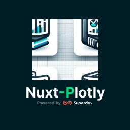

<p align="center">
  <a href="https://github.com/superdev-tech/nuxt-plotly" target="_blank" rel="noopener noreferrer">
    
  </a>
</p>
<br/>

<p align="center">
  <a href="https://pinia.vuejs.org" target="_blank" rel="noopener noreferrer">
    
  </a>
</p>
<br/>
<p align="center">
  <a href="https://npmjs.com/package/pinia"></a>
  <a href="https://github.com/vuejs/pinia/actions/workflows/test.yml?query=branch%3Av2"></a>
  <a href="https://codecov.io/github/vuejs/pinia"></a>
</p>
<br/>

# Nuxt Plotly Module

[![npm version][npm-version-src]][npm-version-href]
[![npm downloads][npm-downloads-src]][npm-downloads-href]
[![License][license-src]][license-href]
[![Nuxt][nuxt-src]][nuxt-href]

📊 `nuxt-plotly` module is thin Nuxt3 wrapper for [plotly.js](https://plotly.com/javascript/)

- [✨ &nbsp;Release Notes](/CHANGELOG.md)
- [🏀 Online playground](https://stackblitz.com/edit/nuxt-starter-1bs1ke?file=app.vue)
- [📖 &nbsp;Plotly Documentation](https://plotly.com/javascript/plotly-fundamentals/)

## Features

<!-- Highlight some of the features your module provide here -->

- 🎇 &nbsp; All plotly.js methods and events
- 🗾 &nbsp; Auto redraw on screensize changes and props update
- 🚀 &nbsp; Data reactivity
- 🏝️ &nbsp; TypeScript support

Sure! Here's the updated Markdown with the improvements:

## Type Aliases

These type aliases simplify the usage of Plotly types in your Nuxt project:

```typescript
/**
 * Represents an array of Plotly data objects.
 */
export type NuxtPlotlyData = Array<Plotly.Data>;

/**
 * Represents a partial configuration object for Plotly charts.
 */
export type NuxtPlotlyConfig = Partial<Plotly.Config>;

/**
 * Represents a partial layout object for Plotly charts.
 */
export type NuxtPlotlyLayout = Partial<Plotly.Layout>;

/**
 * Represents a partial HTML element that holds a rendered Plotly chart.
 */
export type NuxtPlotlyHTMLElement = Partial<Plotly.PlotlyHTMLElement>;
```

With these type aliases, you can easily work with Plotly data, configurations, layouts, and HTML elements in your Nuxt application, enhancing your experience when creating interactive charts and visualizations.

## Plotly Event listeners

You can access [Plotly events](https://plotly.com/javascript/plotlyjs-events) using the `@on-ready` directive to receive the `PlotlyHTMLElement` object from the `<nuxt-plotly>` component.

- HTML template example

```html
<template>
  <client-only>
    <nuxt-plotly
      :data="data"
      :layout="layout"
      :config="config"
      @on-ready="myChartOnReady"
    ></nuxt-plotly>
  </client-only>
</template>
```

- After receiving the PlotlyHTMLElement, you can access Plotly events

```typescript
function myChartOnReady(plotlyHTMLElement: NuxtPlotlyHTMLElement) {
  console.log({ plotlyHTMLElement });

  plotlyHTMLElement.on?.("plotly_afterplot", function () {
    console.log("done plotting");
  });

  plotlyHTMLElement.on?.("plotly_click", function () {
    alert("You clicked this Plotly chart!");
  });
}
```

## Require client-side

There are two ways to use the `nuxt-plotly` module on the client-side in Nuxt3:

1. Wrap the component with the `<client-only>` tag.

```html
<client-only>
  <nuxt-plotly
    :data="pieChart.data"
    :layout="pieChart.layout"
    :config="pieChart.config"
    style="width: 100%"
  ></nuxt-plotly>
</client-only>
```

2. Create a file with the `.client.vue` extension, for example, `PlotlyPieChart.client.vue` and then you can use the component without the `<client-only>` tag.

- 🎯 &nbsp; [See Example](/playground/app.vue)

## Quick Setup

1. Add `nuxt-plotly` dependency to your project

```bash
# Using pnpm
pnpm add -D nuxt-plotly

# Using yarn
yarn add --dev nuxt-plotly

# Using npm
npm install --save-dev nuxt-plotly
```

2. Add `nuxt-plotly` to the `modules` section of `nuxt.config.ts`

```js
export default defineNuxtConfig({
  modules: ["nuxt-plotly"],
});
```

3. Add `plotly.js-dist-min` to the `vite.optimizeDeps.include` section of `nuxt.config.ts`

```js
export default defineNuxtConfig({
  vite: {
    optimizeDeps: {
      include: ["plotly.js-dist-min"],
    },
  },
});
```

That's it! You can now use Nuxt Plotly Module in your Nuxt app ✨

## Development: If you want to contribute

```bash
# Install dependencies
npm install

# Generate type stubs
npm run dev:prepare

# Develop with the playground
npm run dev

# Build the playground
npm run dev:build

# Run ESLint
npm run lint

# Run Vitest
npm run test
npm run test:watch

# Release new version
npm run release
```

<!-- Badges -->

[npm-version-src]: https://img.shields.io/npm/v/nuxt-plotly/latest.svg?style=flat&colorA=18181B&colorB=28CF8D
[npm-version-href]: https://npmjs.com/package/nuxt-plotly
[npm-downloads-src]: https://img.shields.io/npm/dm/nuxt-plotly.svg?style=flat&colorA=18181B&colorB=28CF8D
[npm-downloads-href]: https://npmjs.com/package/nuxt-plotly
[license-src]: https://img.shields.io/npm/l/nuxt-plotly.svg?style=flat&colorA=18181B&colorB=28CF8D
[license-href]: https://npmjs.com/package/nuxt-plotly
[nuxt-src]: https://img.shields.io/badge/Nuxt-18181B?logo=nuxt.js
[nuxt-href]: https://nuxt.com/modules/nuxt-plotly
